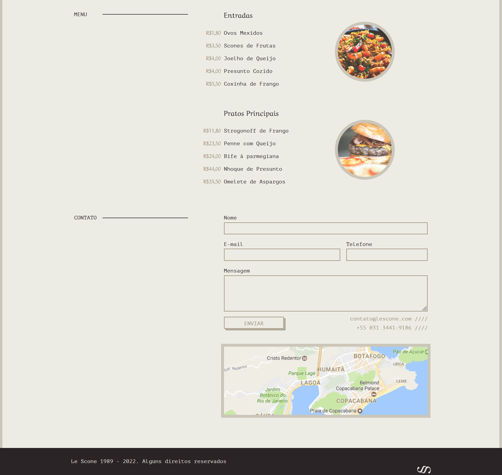

# lescone

Um site para um restaurante.
Projeto realizado durante o curso de SCSS da Origamid.

## Resumo
Neste curso foi ensinado as principais funcionalidades de um pré-processador css, como: 
- Criação de varíaveis
- Criação de funções e mixins
- Utilização de 'imports'
E por fim, estruturas de repetições e condicionais.

## Resultado

